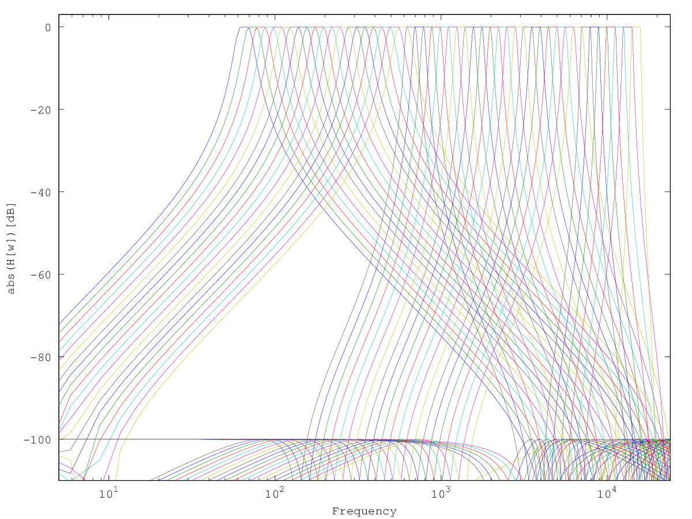
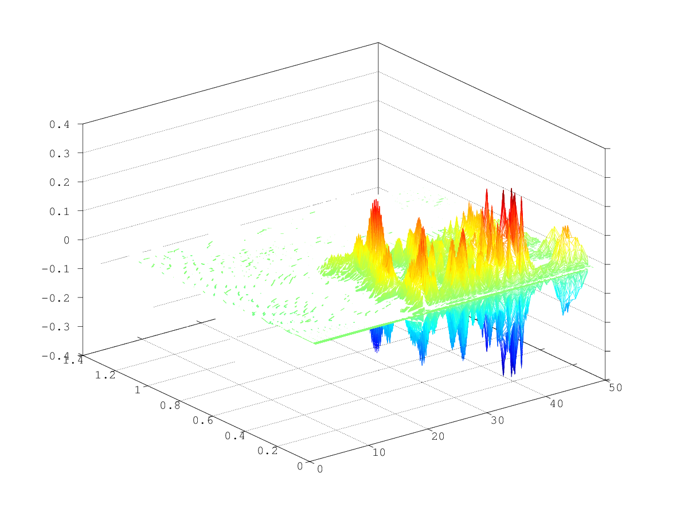
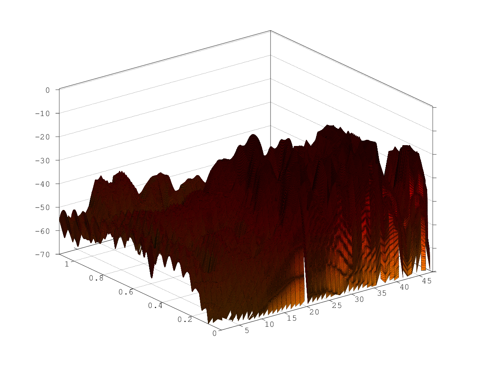

# FVocoder

Freiburg Vocoder simulation

## Description

* 48-bank 1-tone elliptic filter
* mono output
* matrix between analysis (envelope following) and resynthesis
* usage of the two filter banks separately (switching on and off selected filters)
* OSC control for filter switching

## Output snapshots

* Filter bank frequency response
  
* Filter bank output with a real signal
  
* Envelope follower bank output with a real signal
  
