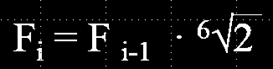

# Calcolo delle frequenze

Le frequenze sono calcolate con la regola che segue:

(quindi sulla *prima* scala esatonale)
a partire dalla frequenza di 65.4 Hz sino alla frequenza 14915.78 Hz.

Come riferimento (soprattutto per la larghezza di banda), ecco la risposta in
frequenza di uno dei filtri centrato su Do 2093 Hz.

